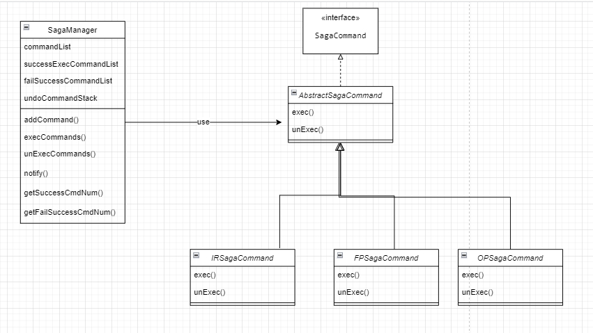
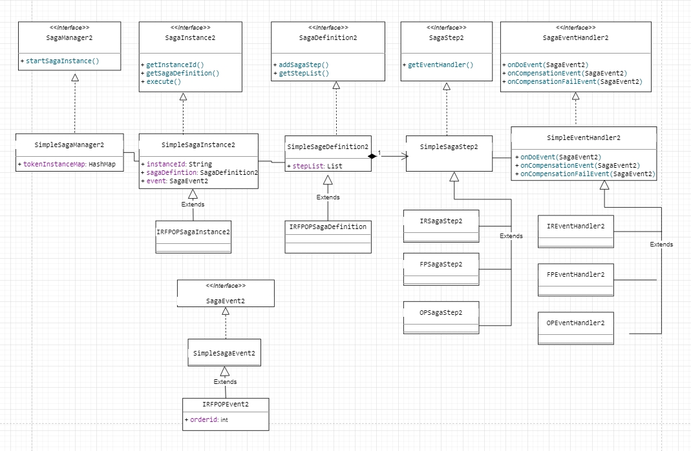
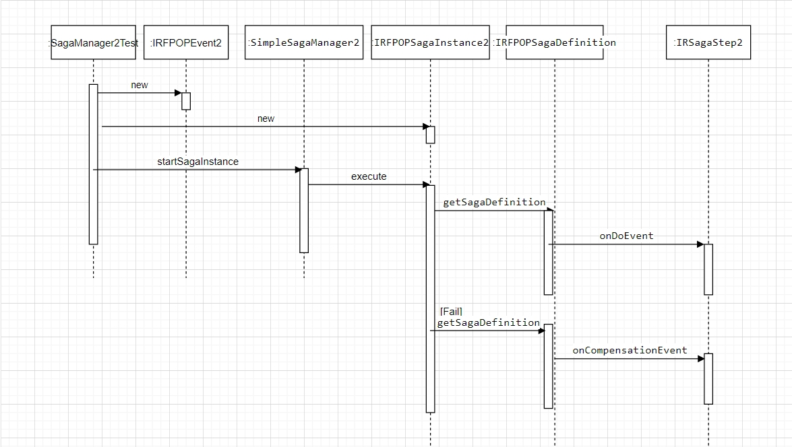
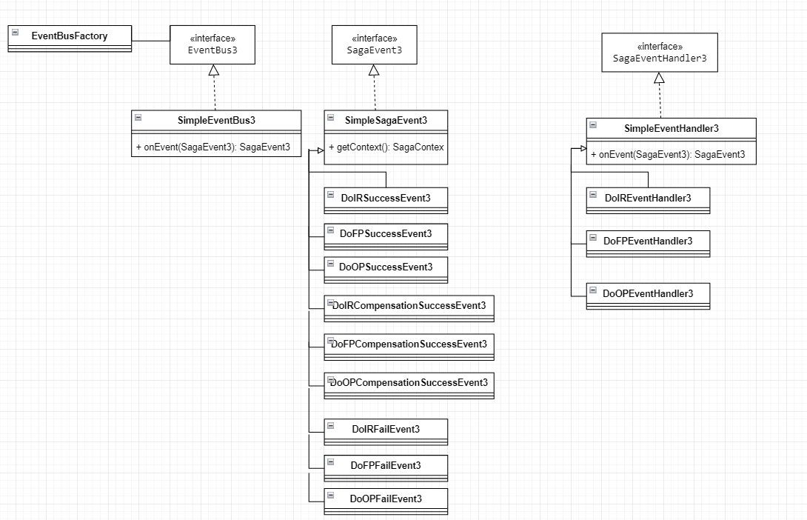
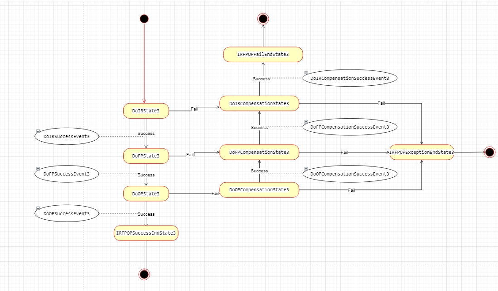

# sagasample
//=========================================

saga1:Command Mode

Class Diagram:

//=========================================

sgag2:EventModel + Orchestration + Diagram

Class Diagram:

Sequence Diagram:

//=========================================

saga3:State pattern + EventBus

Class Diagram:

State Diagram:

//=========================================